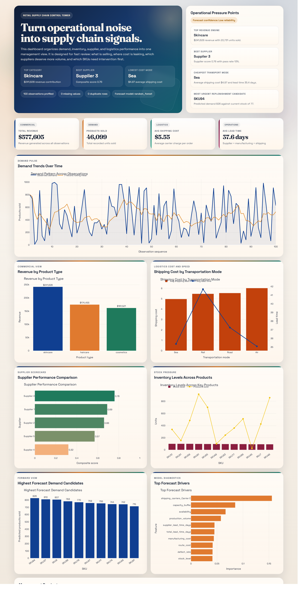
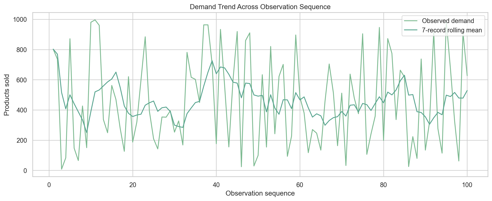
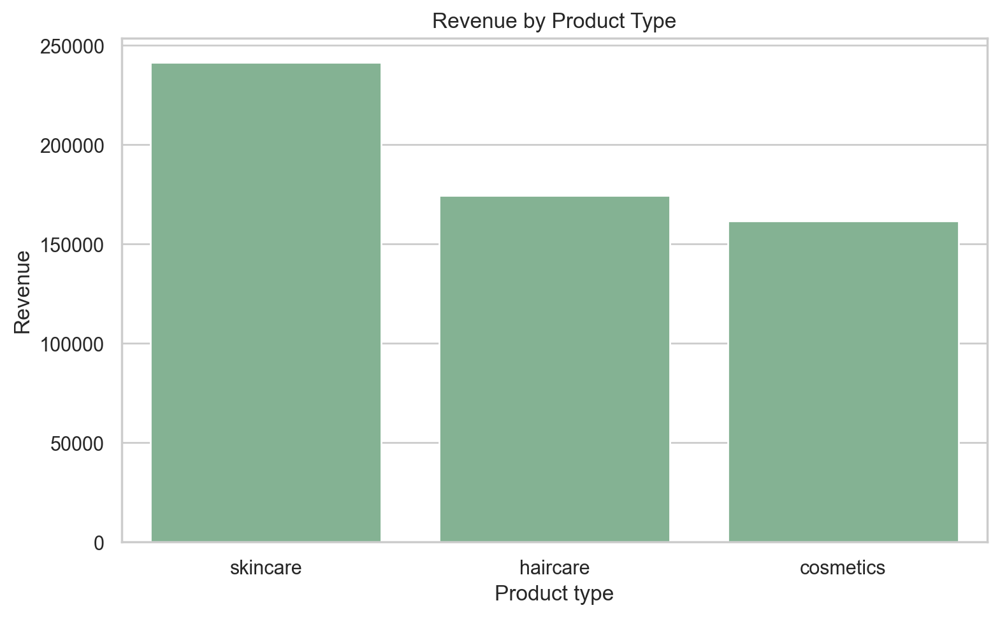
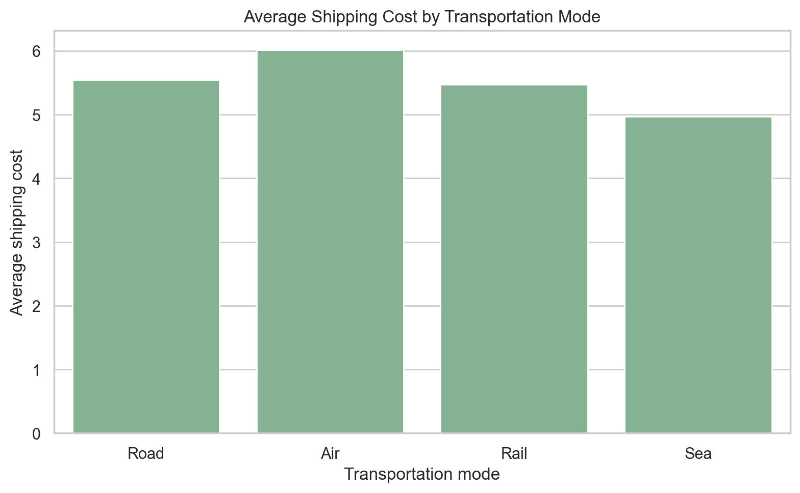
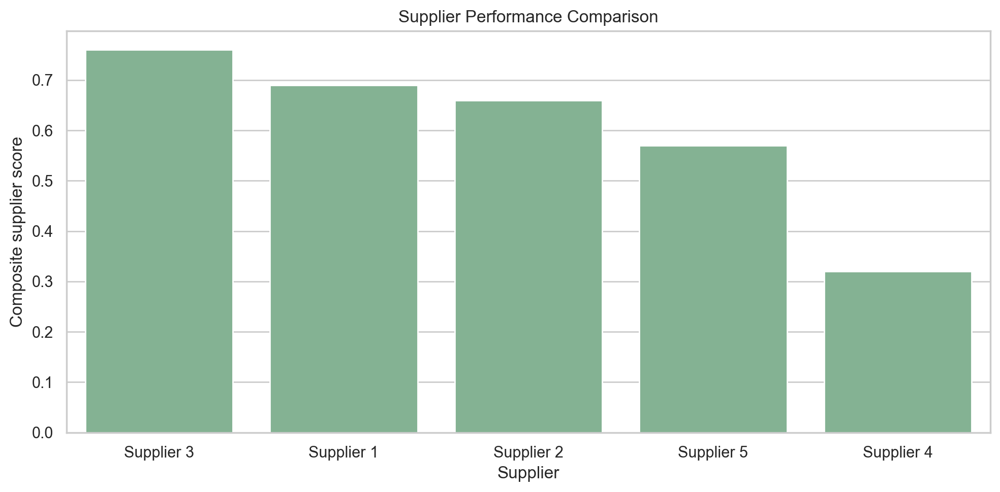
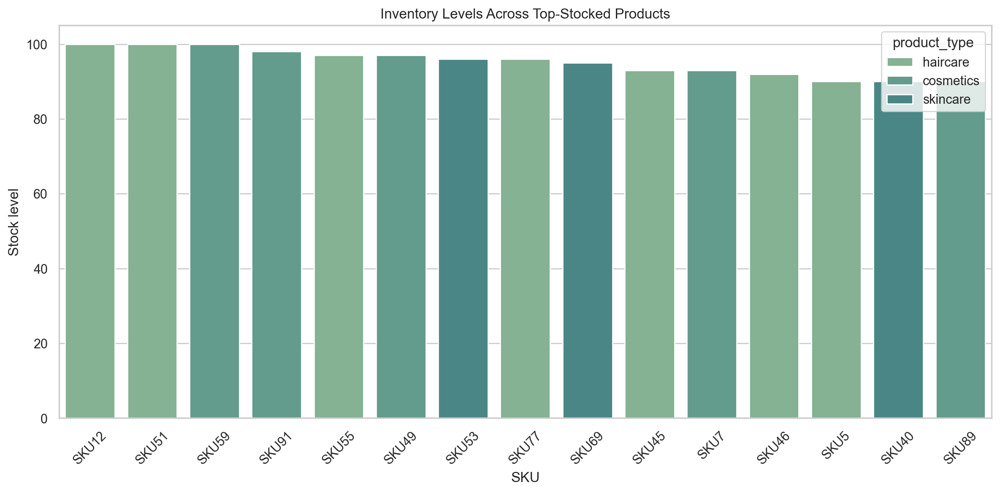

# Supply Chain Demand Forecasting and Logistics Analytics Dashboard


This project presents an end-to-end supply chain analytics workflow for a retail business. It cleans and profiles raw supply chain data, explores operational patterns, evaluates supplier and logistics performance, builds a demand forecasting model, and publishes the results in a polished business intelligence dashboard.

> **Project Summary**  
> A retail supply chain analytics project that transforms raw operational data into management-ready KPIs, exploratory insights, forecast outputs, and an interactive control-tower dashboard.

| Area | Summary |
|---|---|
| Business focus | Demand planning, inventory optimization, supplier evaluation, and logistics efficiency |
| Core deliverables | Cleaned data, report, forecast outputs, and interactive dashboard |
| Main dashboard KPIs | Total revenue, total products sold, average shipping cost, average lead time |
| Key technologies | Python, pandas, seaborn, scikit-learn, Plotly |

## Dashboard Snapshot

### Full Dashboard Preview



## Project Overview

The goal of this project is to help managers answer practical supply chain questions:

- Which product categories generate the most revenue?
- Where are inventory imbalances creating risk?
- Which suppliers are performing best or worst?
- Which transportation modes are cost-efficient versus slow or expensive?
- Which SKUs may require replenishment based on forecast demand?

The workflow is implemented in Python and produces both analytical artifacts and a presentation-ready HTML dashboard.

## Features

- Data cleaning and preprocessing for the supply chain dataset
- Exploratory data analysis on demand, revenue, inventory, suppliers, and logistics
- Derived KPI calculation for business monitoring
- Demand forecasting using machine learning
- Interactive HTML dashboard for management reporting
- Exported plots, cleaned data, forecast outputs, and written analysis report

## Dashboard Description

The dashboard is designed as a supply chain control tower rather than a simple chart sheet. It includes:

- KPI cards for total revenue, total products sold, average shipping cost, and average lead time
- A management summary section highlighting pressure points and operational risks
- Demand trend visualization across observations
- Revenue by product type
- Shipping cost by transportation mode with lead-time context
- Supplier performance comparison using a composite score
- Inventory levels across products
- Forecast demand candidates and model driver views

The dashboard output is available at [outputs/supply_chain_dashboard.html](outputs/supply_chain_dashboard.html).

## Visual Preview

These generated visuals are included in the repository as previews of the full dashboard analysis.

### Demand Trend



### Revenue by Product Type



### Shipping Cost by Transportation Mode



### Supplier Performance Comparison



### Inventory Levels Across Products



## Repository Structure

```text
.
|-- assets/
|   `-- screenshots/
|       `-- dashboard-full.png
|-- analysis/
|   `-- supply_chain_analysis.py
|-- data/
|   `-- supply_chain_data.csv
|-- outputs/
|   |-- analysis_report.md
|   |-- demand_forecast_results.csv
|   |-- forecast_metrics.json
|   |-- supply_chain_cleaned.csv
|   |-- supply_chain_dashboard.html
|   `-- plots/
|       |-- correlation_heatmap.png
|       |-- demand_trend.png
|       |-- forecast_actual_vs_predicted.png
|       |-- forecast_feature_importance.png
|       |-- inventory_levels.png
|       |-- revenue_by_product_type.png
|       |-- shipping_cost_by_transport_mode.png
|       `-- supplier_performance.png
|-- requirements.txt
`-- README.md
```

## Installation

Create and activate a virtual environment, then install the dependencies.

### Windows PowerShell

```powershell
python -m venv .venv
.\.venv\Scripts\Activate.ps1
pip install -r requirements.txt
```

## How to Run

From the project root, run:

```powershell
python analysis/supply_chain_analysis.py
```

This will regenerate the full set of outputs in the [outputs](outputs) folder.

To open the dashboard directly:

```powershell
start .\outputs\supply_chain_dashboard.html
```

## Main Outputs

- Dashboard: [outputs/supply_chain_dashboard.html](outputs/supply_chain_dashboard.html)
- Analytical report: [outputs/analysis_report.md](outputs/analysis_report.md)
- Clean dataset: [outputs/supply_chain_cleaned.csv](outputs/supply_chain_cleaned.csv)
- Forecast results: [outputs/demand_forecast_results.csv](outputs/demand_forecast_results.csv)
- Forecast metrics: [outputs/forecast_metrics.json](outputs/forecast_metrics.json)

## Business Insights

Based on the current dataset and generated outputs:

- Skincare is the strongest revenue-contributing product category.
- Sea transport is the lowest-cost mode on average, though mode choice should still consider lead-time requirements.
- Supplier performance varies materially, making supplier scorecards useful for allocation decisions.
- Inventory imbalances exist between current stock and observed or forecast demand.
- The current forecasting model is useful as a workflow demonstration, but model quality is limited because the dataset has no true date field.

## Technical Notes

- The source dataset does not include transaction or shipment dates, so demand is modeled with supervised machine learning rather than classical time-series forecasting.
- Forecast quality should be treated as directional until a richer historical dataset is available.
- The generated dashboard is a static HTML artifact with interactive Plotly charts.

## Future Improvements

- Add true date fields for time-series forecasting
- Add interactive filters by supplier, product type, and transport mode
- Convert the dashboard into a Streamlit or Power BI style application
- Expand the data model with service-level and delivery-performance metrics
